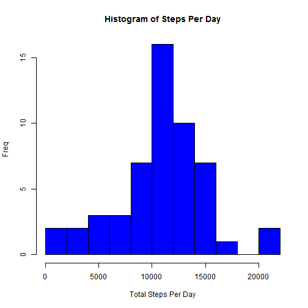
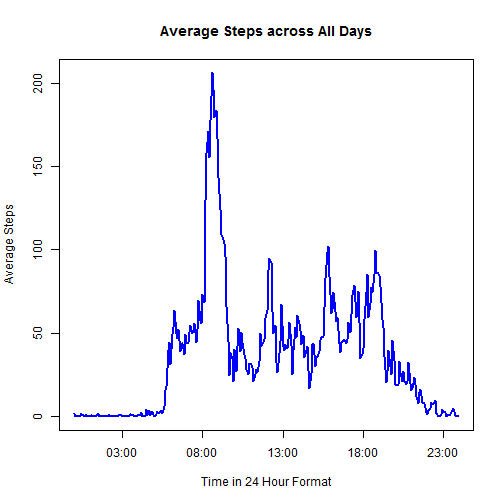
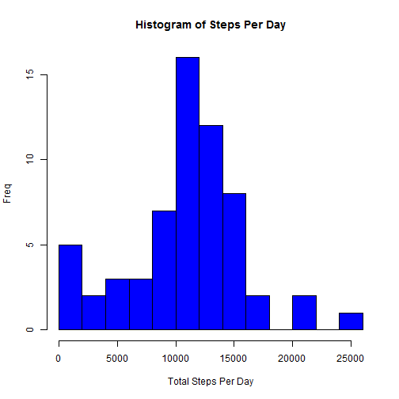
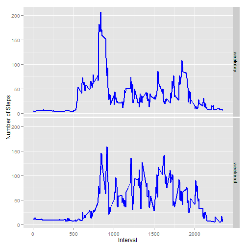

##Reproducible Research: Peer Assessment 1

It is now possible to collect a large amount of data about personal movement using activity monitoring devices such as a Fitbit, Nike Fuelband, or Jawbone Up. These type of devices are part of the "quantified self" movement - a group of enthusiasts who take measurements about themselves regularly to improve their health, to find patterns in their behavior, or because they are tech geeks. But these data remain under-utilized both because the raw data are hard to obtain and there is a lack of statistical methods and software for processing and interpreting the data.  

This assignment makes use of data from a personal activity monitoring device. This device collects data at 5 minute intervals through out the day. The data consists of two months of data from an anonymous individual collected during the months of October and November, 2012 and include the number of steps taken in 5 minute intervals each day.  

####Loading and processing data

Using the below code ,i am going to read the csv file i download earlier  
Also displayed the summary of activity data set.

```r
options(warn=-1)
activity=read.csv('activity.csv')
summary(activity)
```

```
##      steps                date          interval     
##  Min.   :  0.00   2012-10-01:  288   Min.   :   0.0  
##  1st Qu.:  0.00   2012-10-02:  288   1st Qu.: 588.8  
##  Median :  0.00   2012-10-03:  288   Median :1177.5  
##  Mean   : 37.38   2012-10-04:  288   Mean   :1177.5  
##  3rd Qu.: 12.00   2012-10-05:  288   3rd Qu.:1766.2  
##  Max.   :806.00   2012-10-06:  288   Max.   :2355.0  
##  NA's   :2304     (Other)   :15840
```
From the sumary , we can see there are 3 variables steps ,date and interval .
Steps variable have many NA entries, which we will handle later.  


#### 1. What is mean total number of steps taken per day? 
<br/>
<br/>  

##### a) Make a histogram of the total number of steps taken each day

```r
library(plyr)
Steps_Per_Day=ddply(activity,~date,summarise,steps_per_day=sum(steps))
hist(Steps_Per_Day$steps_per_day,breaks=10,col='blue',main='Histogram of Steps Per Day',xlab='Total Steps Per Day',ylab='Freq')
```

 
<br/>
<br/>  

##### b) Calculate and report the mean and median total number of steps taken per day

```r
mean(Steps_Per_Day$steps_per_day,na.rm=T)
```

```
## [1] 10766.19
```

```r
median(Steps_Per_Day$steps_per_day,na.rm=T)
```

```
## [1] 10765
```
<br/>
<br/>
<br/>
<br/>  

#### 2.What is the average daily activity pattern?
<br/>
<br/>  

##### a) Make a time series plot (i.e. type = "l") of the 5-minute interval (x-axis) and the average number of steps taken, averaged across all days (y-axis)

```r
library(chron)
Average_Steps=ddply(activity,~interval,summarise,average_steps=mean(steps,na.rm=T))
Average_Steps$time=times(0:287/288)
Average_Steps$time=strptime(Average_Steps$time,"%X")
with(Average_Steps,plot(time,average_steps,type='l',col='blue',lwd=2,main='Average Steps across All Days',xlab='Time in 24 Hour Format',ylab='Average Steps'))
```

 
<br/>
<br/>  

##### b) Which 5-minute interval, on average across all the days in the dataset, contains the maximum number of steps?


```r
Average_Steps[which.max(Average_Steps[,2]),]$interval
```

```
## [1] 835
```
<br/>
<br/>
<br/>
<br/>  

#### 3.Imputing missing values
<br/>
<br/>  

##### a) Calculate and report the total number of missing values in the dataset (i.e. the total number of rows with NAs)

From the summary we saw that only steps variable had missign values ,so we will consider only 'steps' variable to find the number of missing values

```r
sum(is.na(activity$steps))
```

```
## [1] 2304
```
<br/>
<br/>  

##### b) Devise a strategy for filling in all of the missing values in the dataset. The strategy does not need to be sophisticated. For example, you could use the mean/median for that day, or the mean for that 5-minute interval, etc.  

Here we will choose to fill the missing values using the mean for that 5-minute interval across all days . we chose mean for 5 minute period because 5 minute interval can be compared to same 5 minute interval another day , it is apple to apple comprasion .
<br/>
<br/>  

##### c) Create a new dataset that is equal to the original dataset but with the missing data filled in  


Now we will create a dataset 'activity_impute' by using the strategy we deviced in previous steps

```r
activity_impute=activity
only_na=activity_impute[is.na(activity_impute$steps),]
merge=merge(x = only_na, y =Average_Steps , by = "interval", all.x=TRUE)
activity_impute[is.na(activity_impute$steps),]$steps=merge$average_steps
summary(activity_impute)
```

```
##      steps                date          interval     
##  Min.   :  0.00   2012-10-01:  288   Min.   :   0.0  
##  1st Qu.:  0.00   2012-10-02:  288   1st Qu.: 588.8  
##  Median :  0.00   2012-10-03:  288   Median :1177.5  
##  Mean   : 37.38   2012-10-04:  288   Mean   :1177.5  
##  3rd Qu.: 27.00   2012-10-05:  288   3rd Qu.:1766.2  
##  Max.   :806.00   2012-10-06:  288   Max.   :2355.0  
##                   (Other)   :15840
```

<br/>
<br/>  

##### d) Make a histogram of the total number of steps taken each day and Calculate and report the mean and median total number of steps taken per day. Do these values differ from the estimates from the first part of the assignment? What is the impact of imputing missing data on the estimates of the total daily number of steps?


```r
library(plyr)
Steps_Per_Day=ddply(activity_impute,~date,summarise,steps_per_day=sum(steps))
hist(Steps_Per_Day$steps_per_day,breaks=10,col='blue',main='Histogram of Steps Per Day',xlab='Total Steps Per Day',ylab='Freq')
```

 


After imputing , our mean reamins the same but median increased to 11015 from 10765


```r
mean(Steps_Per_Day$steps_per_day,na.rm=T)
```

```
## [1] 10766.19
```

```r
median(Steps_Per_Day$steps_per_day,na.rm=T)
```

```
## [1] 11015
```
<br/>
<br/>
<br/>
<br/>  

#### 4.Are there differences in activity patterns between weekdays and weekends?
<br/>
<br/>  

##### a) Create a new factor variable in the dataset with two levels - "weekday" and "weekend" indicating whether a given date is a weekday or weekend day.

we will create a new POSIXlt field from date field ,after which we will find the day using 'weekdays' function.

Finally we will create a field day_category which contains a given day is weekday or weekend  

```r
activity_impute$date_new=strptime(activity_impute$date,"%F")
activity_impute$day_category=(weekdays(activity_impute$date_new)==('Sunday'))|(weekdays(activity_impute$date_new)==('Saturday'))
activity_impute$day_category=as.factor(activity_impute$day_category)
levels(activity_impute$day_category)=c('weekday','weekend')
```
<br/>
<br/>  

##### b) Make a panel plot containing a time series plot (i.e. type = "l") of the 5-minute interval (x-axis) and the average number of steps taken, averaged across all weekday days or weekend days (y-axis). See the README file in the GitHub repository to see an example of what this plot should look like using simulated data.  


```r
library(ggplot2)
Average_Steps=ddply(activity_impute,.(interval,day_category),summarise,average_steps=mean(steps,na.rm=T))
Average_Steps$time=times(0:287/288)
Average_Steps$time=strptime(Average_Steps$time,"%X")
p=ggplot(Average_Steps,aes(interval,average_steps))
p+geom_line(col='blue',lwd=1)+facet_grid(day_category~.)+labs(x='Interval',y='Number of Steps')
```

 

